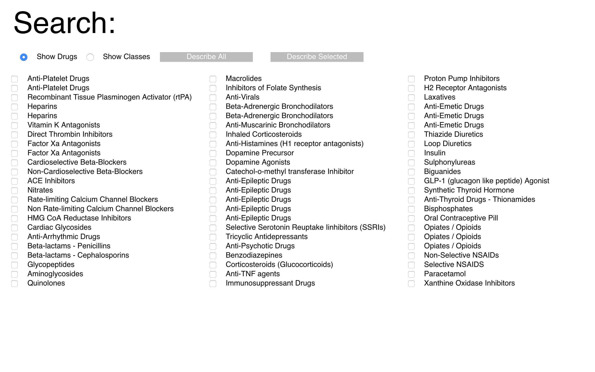
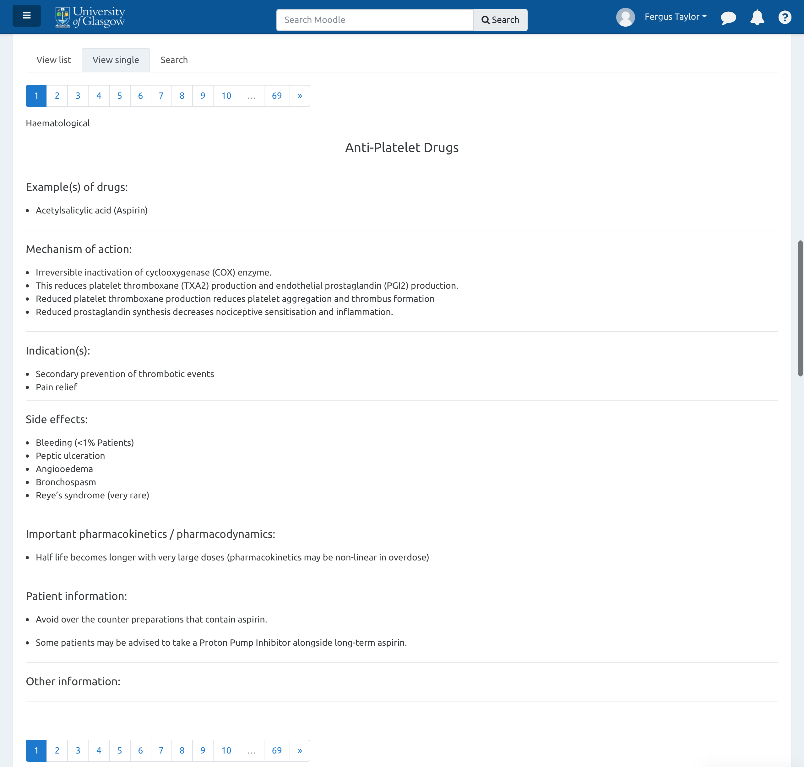

50 Drugs
================

Earlier this September I started my final year of Medicine at the University of Glasgow. Not wanting to be too out-of-date before returning to the wards, I looked back over a course resource summarising the 50 most commmonly used drugs on the ward.

This is an interesting project created by SSC students, ..., and .... at my University. Unfortunately, the resource itself isn't prepared in an ideal form for revision.

Point 1. Example info always listed at the top of every page.

Point 2. List info. Nothing really wrong with it. But not really concise.

Point 3. Search info. Ok, but it relaods the entire page and there's no results as you type.

Finally the info. It's useful. Switching between drugs is difficult however. And I can't list multiple drugs together.

As you can see, the original interface is quite messy. There's a lot of unnecessary information listed.

You can't tell from photos, but switching between tabs causes the entire page to reload, and you have to scroll through all the unnecessary information to get back to the important bits. Not a huge problem, but all of it adds unnecessary delays which makes the whole experience unwieldy.

I wondered instead if there might be a better way to create an interface for it, similar to how I had presented the [BNF project.](https://fergustaylor.github.io/D3/bnf-interactions/) This is an active project with ongoing work, [described here.](https://fergustaylor.github.io/categories/bnf/)

This presented me with an interesting project and a series of main problems.

#### Problems

1.  getting the data

The data itself is a course resource, kept in our course materials/lecture repository Moodle. It requires I log-in to see the data, making it a more complicated webscrape session.

1.  formatting it 

The data then has to be processed in an R session to produce a file format I can use online. (I.e a JSON file).

2.  creating a useful interface for presenting the data

Then the part I wanted to revise from. I wanted a simple user interface that could present multiple drugs at a time. I wanted something searchable that I could create custom selections with - at least to the level of organisation already applied to that dataset, (general drug classes).
