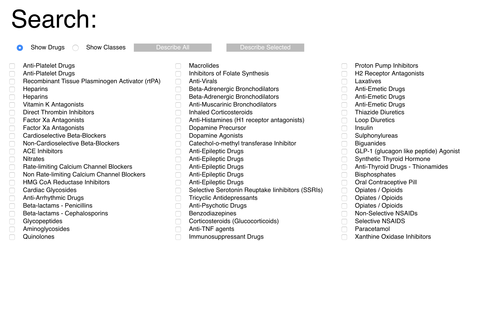
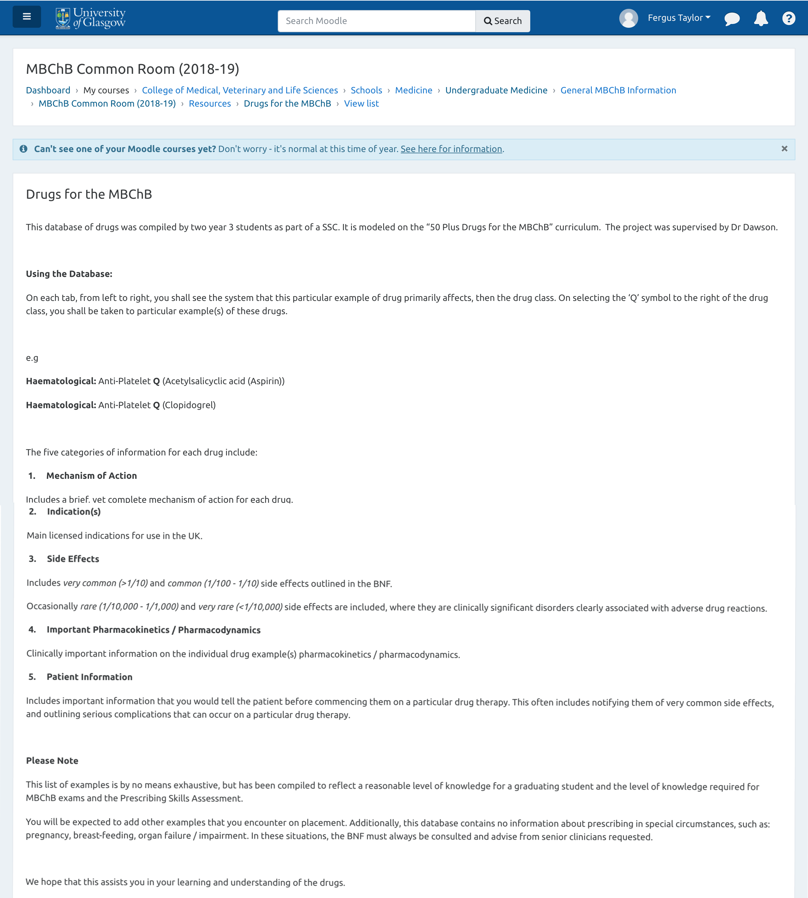
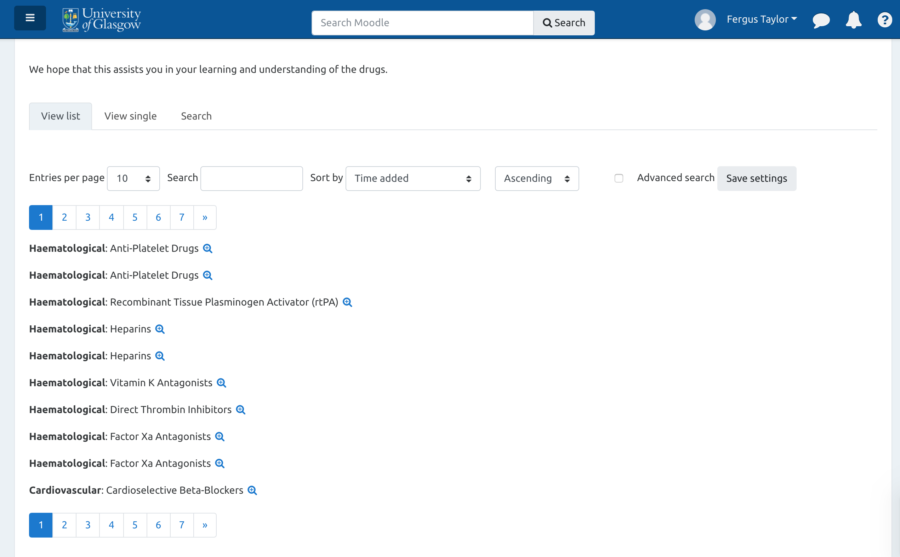
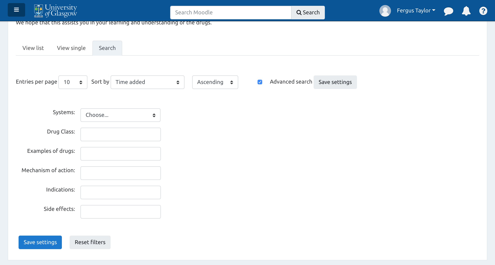
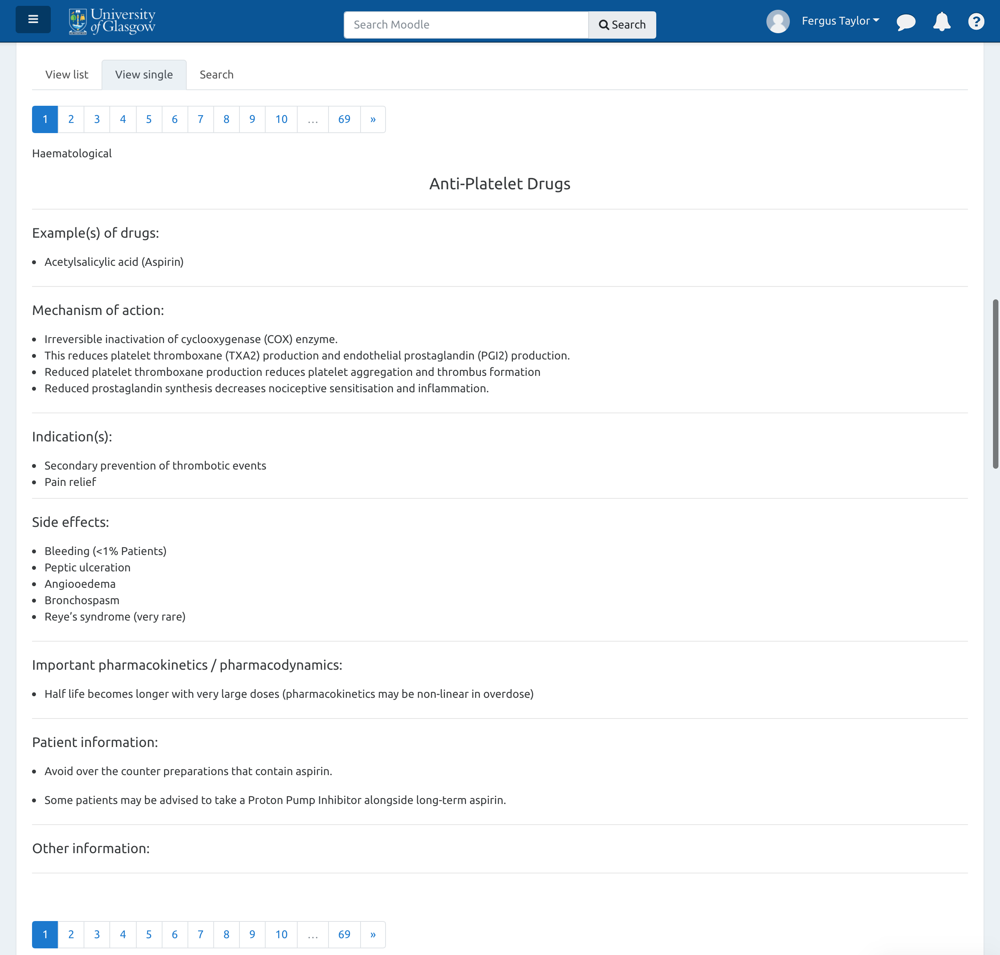

50 Drugs
================

Earlier this September I started my final year of Medicine at the
University of Glasgow. Not wanting to be too out-of-date before
returning to the wards, I looked back over a course resource summarising
the 50 most commmonly used drugs on the ward.

This is an interesting project created by SSC students, …, and …. at my
University. Unfortunately, the resource itself isn’t prepared in an
ideal form for revision.

Point 1. Example info always listed at the top of every page.

Point 2. List info. Nothing really wrong with it. But not really
concise.

Point 3. Search info. Ok, but it relaods the entire page and there’s no
results as you type.

Finally the info. It’s useful. Switching between drugs is difficult
however. And I can’t list multiple drugs together.

As you can see, the original interface is quite messy. There’s a lot of
unnecessary information listed.

You can’t tell from photos, but switching between tabs causes the entire
page to reload, and you have to scroll through all the unnecessary
information to get back to the important bits. Not a huge problem, but
all of it adds unnecessary delays which makes the whole experience
unwieldy.

I wondered instead if there might be a better way to create an interface
for it, similar to how I had presented the [BNF
project.](https://fergustaylor.github.io/D3/bnf-interactions/) This is
an active project with ongoing work, [described
here.](https://fergustaylor.github.io/categories/bnf/)

This presented me with an interesting project and a series of main
problems.

\#\#\#\#Problems

1.  getting the data
    
    The data itself is a course resource, kept in our course
    materials/lecture repository Moodle.  It requires I log-in to see
    the data, making it a more complicated webscrape session.

2.  formatting it
    
    The data then has to be processed in an R session to produce a file
    format I can use online. (I.e a JSON file).

3.  creating a useful interface for presenting the data
    
    Then the part I wanted to revise from. I wanted a simple user
    interface that could present multiple drugs at a time.   I wanted
    something searchable that I could create custom selections with - at
    least to the level of organisation already applied to that dataset,
    (general drug classes).

I decided to use the Rscraping tool Rvest, modified to download through
the log-in.
