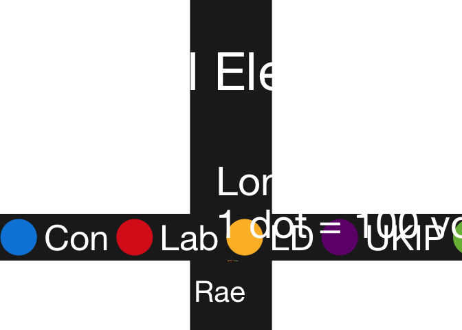
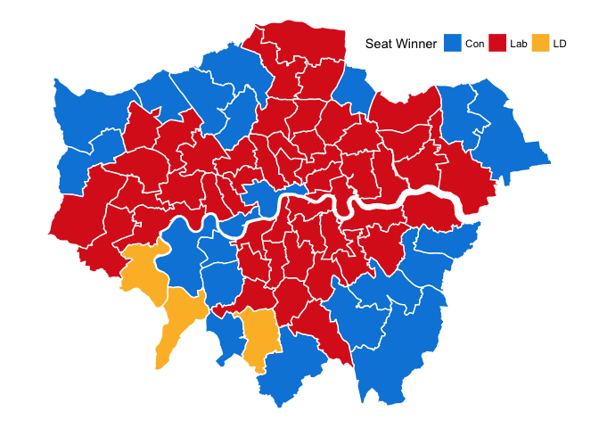

<https://www.cultureofinsight.com/blog/2018/05/02/2018-04-08-multivariate-dot-density-maps-in-r-with-sf-ggplot2/>

Load the libraries

    library(tidyverse) # dev version of ggplot2 required devtools::install_github('hadley/ggplot2')
    library(sf)
    library(lwgeom)

Load the data

    # election results filtered to London region
    ge_data <- read_csv("http://researchbriefings.files.parliament.uk/documents/CBP-7979/HoC-GE2017-constituency-results.csv") %>% 
      filter(region_name == "London") %>% 
      select(ons_id, constituency_name, first_party, Con = con, Lab = lab, LD = ld, UKIP = ukip, Green = green)

    # shapefile filtered to London region
    # data available here: https://www.dropbox.com/s/4iajcx25grpx5qi/uk_650_wpc_2017_full_res_v1.8.zip?dl=0
    uk <- st_read("uk_650_wpc_2017_full_res_v1.8/uk_650_wpc_2017_full_res_v1.8.shp", stringsAsFactors = FALSE, quiet = TRUE) %>% 
      st_transform(4326) %>% 
      filter(REGN == "London") %>% 
      select(ons_id = PCONCODE)

    # merge the data
    sf_data <- left_join(ge_data, uk) %>% 
      st_as_sf() # I'm losing sf class after join so make sf object again

    head(sf_data)

    ## Simple feature collection with 6 features and 8 fields
    ## geometry type:  MULTIPOLYGON
    ## dimension:      XY
    ## bbox:           xmin: -0.2050868 ymin: 51.34552 xmax: 0.2176442 ymax: 51.56706
    ## epsg (SRID):    4326
    ## proj4string:    +proj=longlat +datum=WGS84 +no_defs
    ## # A tibble: 6 x 9
    ##   ons_id   constituency_name     first_party   Con   Lab    LD  UKIP Green
    ##   <chr>    <chr>                 <chr>       <int> <int> <int> <int> <int>
    ## 1 E140005… Barking               Lab         10711 32319   599  3031   724
    ## 2 E140005… Battersea             Lab         22876 25292  4401   357   866
    ## 3 E140005… Beckenham             Con         30632 15545  4073     0  1380
    ## 4 E140005… Bermondsey and Old S… Lab          7581 31161 18189   838   639
    ## 5 E140005… Bethnal Green and Bow Lab          7576 42969  2982   894  1516
    ## 6 E140005… Bexleyheath and Cray… Con         25113 16040  1201  1944   601
    ## # ... with 1 more variable: geometry <MULTIPOLYGON [°]>

    # data frame of number of dots to plot for each party (1 for every 100 votes)
    num_dots <- ceiling(select(as.data.frame(sf_data), Con:Green) / 100)

    # generates data frame with coordinates for each point + what party it is assiciated with
    sf_dots <- map_df(names(num_dots), 
                      ~ st_sample(sf_data, size = num_dots[,.x], type = "random") %>% # generate the points in each polygon
                        st_cast("POINT") %>%                                          # cast the geom set as 'POINT' data
                        st_coordinates() %>%                                          # pull out coordinates into a matrix
                        as_tibble() %>%                                               # convert to tibble
                        setNames(c("lon","lat")) %>%                                  # set column names
                        mutate(Party = factor(.x, levels = names((num_dots))))        # add categorical party variable
                      ) # map_df then binds each party's tibble into one

    head(sf_dots)

    ## # A tibble: 6 x 3
    ##      lon   lat Party
    ##    <dbl> <dbl> <fct>
    ## 1 0.133   51.5 Con  
    ## 2 0.128   51.5 Con  
    ## 3 0.100   51.5 Con  
    ## 4 0.136   51.5 Con  
    ## 5 0.0799  51.5 Con  
    ## 6 0.107   51.5 Con

    tail(sf_dots)

    ## # A tibble: 6 x 3
    ##      lon   lat Party
    ##    <dbl> <dbl> <fct>
    ## 1 -0.230  51.4 Green
    ## 2 -0.186  51.4 Green
    ## 3 -0.240  51.4 Green
    ## 4 -0.209  51.4 Green
    ## 5 -0.242  51.4 Green
    ## 6 -0.230  51.4 Green

Plot it

    # colour palette for our party points
    pal <- c("Con" = "#0087DC", "Lab" = "#DC241F", "LD" = "#FCBB30", "UKIP" = "#70147A", "Green" = "#78B943")

    ggplot() +
      geom_sf(data = sf_data, fill = "transparent",colour = "white") +
      geom_point(data = sf_dots, aes(lon, lat, colour = Party)) +
      scale_colour_manual(values = pal) +
      coord_sf(crs = 4326, datum = NA) +
      theme_void(base_family = "Helvetica Neue", base_size = 48) +
      labs(x = NULL, y = NULL,
           title = "UK General Election 2017\n",
           subtitle = "London Constituencies\n1 dot = 100 votes",
           caption = "Map by Culture of Insight @PaulCampbell91 | Data Sources: House of Commons Library, Alasdair Rae") +
      guides(colour = guide_legend(override.aes = list(size = 18))) +
      theme(legend.position = c(0.82, 1.03), legend.direction = "horizontal",
            plot.background = element_rect(fill = "#212121", color = NA), 
            panel.background = element_rect(fill = "#212121", color = NA),
            legend.background = element_rect(fill = "#212121", color = NA),
            legend.key = element_rect(fill = "#212121", colour = NA),
            plot.margin = margin(1, 1, 1, 1, "cm"),
            text =  element_text(color = "white"),
            title =  element_text(color = "white"),
            plot.title = element_text(hjust = 0.5),
            plot.caption = element_text(size = 32)
      )

    ggsave("party_points2.png", dpi = 320, width = 80, height = 70, units = "cm")

    ggplot() +
      geom_sf(data = sf_data, aes(fill = first_party), colour = "white") +
      scale_fill_manual(values = pal, name = "Seat Winner") +
      coord_sf(crs = 4326, datum = NA) +
      theme_void() +
      theme(legend.position = c(0.8, 0.9), legend.direction = "horizontal")

