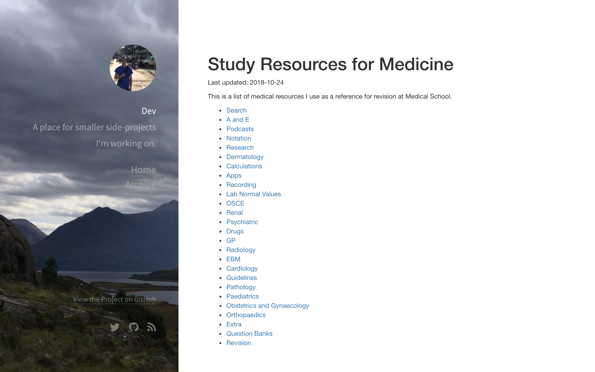
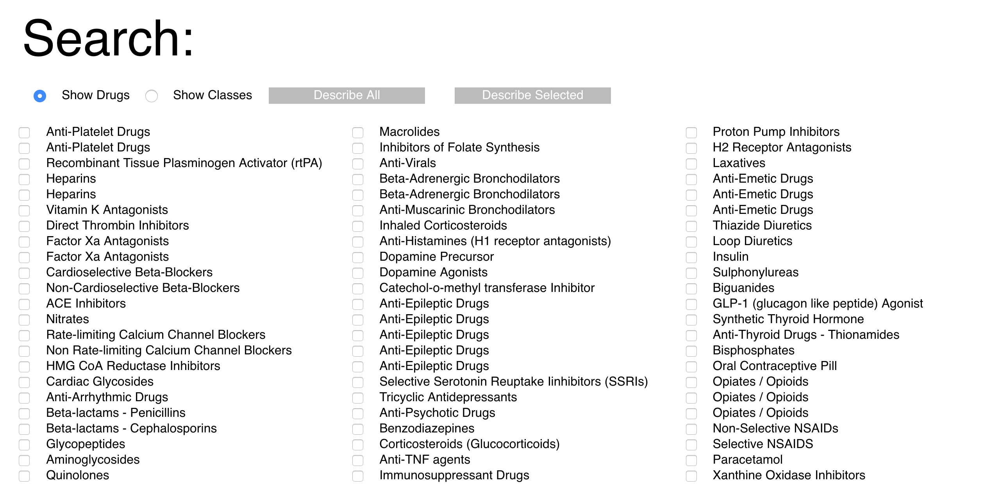
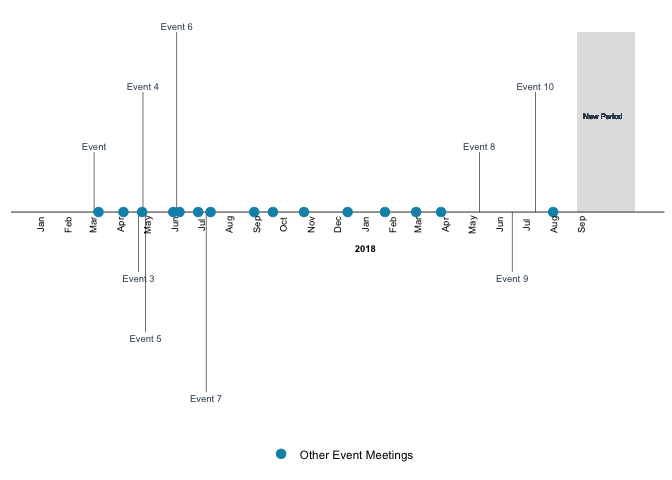
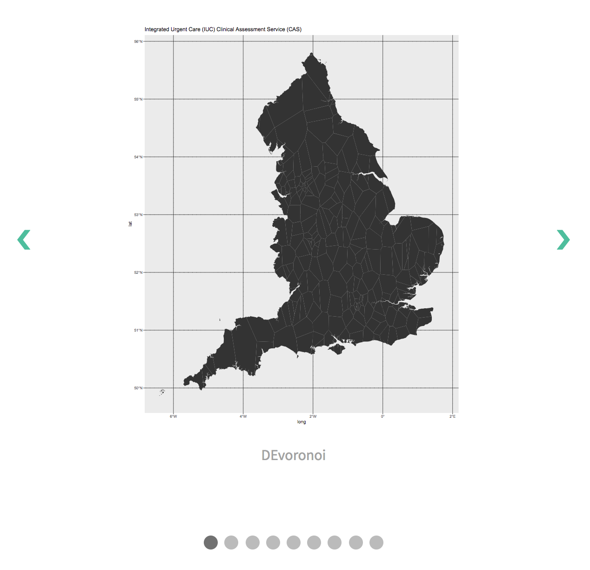
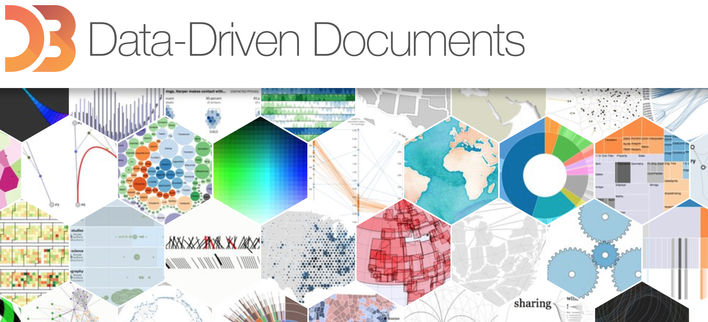

This is the index for 'dev', a Github repository for smaller projects I'm working on.
N.B I renamed it from 'Dev' 17/119/19 so have probably broken a lot of links.

# [Resources](https://fergustaylor.github.io/Dev/resources/)

# [Search](https://fergustaylor.github.io/Dev/Search)
Using [Google Custom Search](https://cse.google.co.uk/cse/) to look at medical resources under one page. 
Hosted without sidebar [here.](https://fergustaylor.github.io/Dev/Search/example.html) 
Uses 'refinements' to group individual site results. Unexpected benefit is the specificity of the autosuggest. 
The most difficult part was creating a dynamic iframe to put it in.

<iframe src="https://player.vimeo.com/video/276458805?autoplay=1&loop=1" style="position:absolute;top:0;left:0;width:100%;height:100%;" frameborder="0" webkitallowfullscreen mozallowfullscreen allowfullscreen></iframe>

# [50 Drugs](https://fergustaylor.github.io/Dev/50 Drugs/)

This is a tool originally built by University of Glasgow students as an SSC project.  
It gives revision information on 50 common drug classes.  
I've since built a new interface.

You can read about it [here](https://fergustaylor.github.io/Dev/50%20Drugs/readme/)

# [Timeline](https://fergustaylor.github.io/Dev/Timeline)

A new 

# [Hackday](https://fergustaylor.github.io/Dev/Hackday)

<iframe id="resizeme" src="https://fergustaylor.github.io/Dev/Hackday/allpoints.html">
</iframe>
<link rel="stylesheet" href="https://fergustaylor.github.io/Dev/css/iframe.css" />

# [Local Elections](https://fergustaylor.github.io/Dev/Local%20Elections/Other_Work)

Recreating a UK local election graphic from [Paul Campbell.](https://www.cultureofinsight.com/blog/2018/05/02/2018-04-08-multivariate-dot-density-maps-in-r-with-sf-ggplot2/)

# [Gallery](https://fergustaylor.github.io/Dev/Gallery)

Making a gallery/slideshow element.

# [Ebola](https://fergustaylor.github.io/Dev/Ebola)

# [Foundation](https://fergustaylor.github.io/Dev/Foundation)

# [R2D3](https://fergustaylor.github.io/Dev/r2d3)

# [D3](https://fergustaylor.github.io/Dev/D3)

