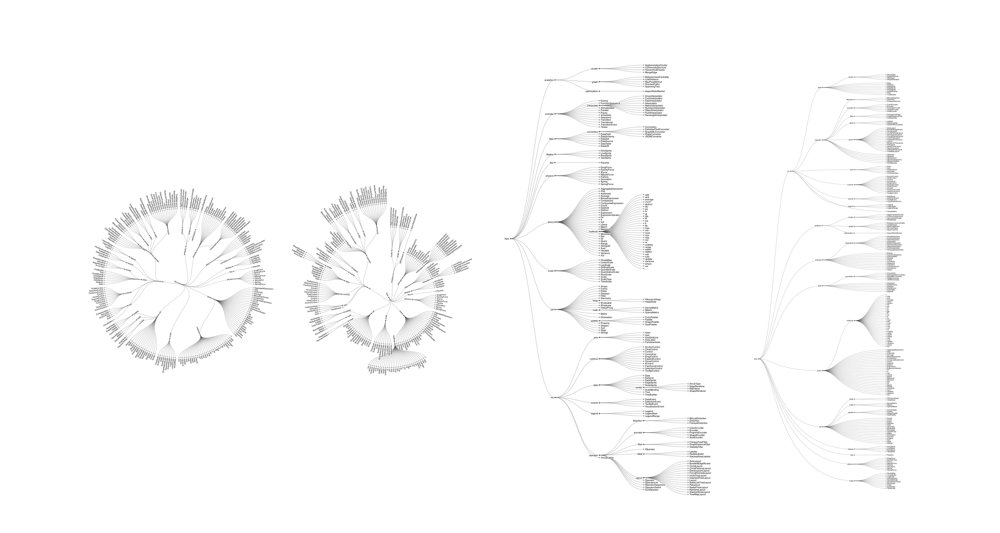
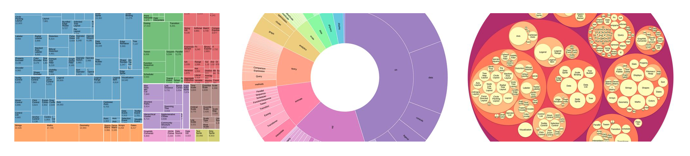

```{r setup, include=FALSE}
knitr::opts_chunk$set(out.width = "100%", comment=FALSE, message=FALSE, warning=FALSE, echo=FALSE, fig.align="center")
Sys.setenv(TZ='GMT')
library(tidyverse)
library(igraph)
library(networkD3)
library(rvest)
library(collapsibleTree)
```

### Graphing antiobiotic trees

The primary clinical guidlines I'm expected to use are [NHS Tayside - A Guide to Antimicrobial Use.](https://www.nhstaysideadtc.scot.nhs.uk/Antibiotic%20site/Antibiotic%20front%20page.htm)

But this NICE guidance is also relevant:

- [Antimicrobial prescribing guidelines](https://www.nice.org.uk/about/what-we-do/our-programmes/nice-guidance/antimicrobial-prescribing-guidelines)

- [Antibacterials, principles of therapy](https://bnf.nice.org.uk/treatment-summary/antibacterials-principles-of-therapy.html)


#### [NHS Tayside Formulary:](http://www.taysideformulary.scot.nhs.uk)

- [Adult Antibiotic Man](https://www.nhstaysideadtc.scot.nhs.uk/Antibiotic%20site/pdf%20docs/Antibiotic%20hospital%20man%20.pdf)

- [Formulary Abx Doses](https://www.nhstaysideadtc.scot.nhs.uk/Antibiotic%20site/drugdosages.htm)

NHS Tayside Area Formulary has a chapter (5), ["Infections".](http://www.taysideformulary.scot.nhs.uk/chaptersSub.asp?FormularySectionID=5)
I've graphed this to show the grouped antimicrobials. Each chapter formulary subsection has an enclosed number (x, y). The first denotes a drug, the second a link.

```{r}
# https://www.r-graph-gallery.com/network-interactive.html
Formulary <- read.csv2("taysideformularynew.csv", sep=",", header=FALSE)
Formulary <- lapply(Formulary, function(x){
  gsub("\xca", "", x)}
  ) %>% as.data.frame %>%
    mutate_all(as.character)
# %>%
#   mutate_if(is.factor, list(~ na_if(., "")))
collapsibleTree(Formulary, c("V1", "V2", "V3", "V4"))

#Edge-list dataframe
data <- data.frame(
  from=c("Formulary"),
  to=c(Formulary$V1)
)
data2 <- data.frame(
  from=c(Formulary$V1),
  to=c(Formulary$V2)
) %>%
    dplyr::distinct()
data3 <- data.frame(
  from=c(Formulary$V2),
  to=c(Formulary$V3)
) %>%
    dplyr::filter(to != "") %>%
    dplyr::distinct()
data4 <- data.frame(
  from=c(Formulary$V3),
  to=c(Formulary$V4)
) %>%
    dplyr::filter(to != "") %>%
    dplyr::distinct()

formularydata <- rbind(data,data2,data3,data4)
plot <- formularydata %>%
simpleNetwork(        
        linkDistance = 2,          # distance between node. Increase this value to have more space between nodes
        charge = -900,              # numeric value indicating either the strength of the node repulsion (negative value) or attraction (positive value)
        fontSize = 14,              # size of the node names
        fontFamily = "serif",       # font og node names
        linkColour = "#18515E",     # colour of edges, MUST be a common colour for the whole graph
        nodeColour = "#69b3a2",     # colour of nodes, MUST be a common colour for the whole graph
        opacity = 0.9,              # opacity of nodes. 0=transparent. 1=no transparency
        zoom = T                    # Can you zoom on the figure?
        )
plot
htmlwidgets::saveWidget(plot, "networkInteractive.html")
rm(data, data2, data3, data4)
```
<!-- Plan: -->
<!-- - Colour above by section. -->
<!-- - Make nodes desectable. -->

See the full version here, [Force Diagram.](./networkInteractive.html)

```{r}
plot2 <- formularydata[-c(1:169),] %>%
  simpleNetwork(        
        linkDistance = 0.05,
        charge = -100,
        fontSize = 20,
        fontFamily = "serif",
        linkColour = "#18515E",
        nodeColour = "#69b3a2",
        opacity = 0.9,
        zoom = T
        )
plot2

htmlwidgets::saveWidget(plot2, "networkInteractive2.html")
```
<!-- Plan: -->
<!-- Separate above into each section. On slideshow. -->

See the full version here, [Force Diagram.](./networkInteractive2.html)

<!-- Optimised as a static version -->

<!-- - [Network chart with R and igraph from any type of input](https://www.r-graph-gallery.com/257-input-formats-for-network-charts.html) -->
<!-- - [Basic network diagram](https://www.r-graph-gallery.com/251-network-with-node-size-based-on-edges-number.html) -->
<!-- - [Network chart with R and igraph: chart parameters](https://www.r-graph-gallery.com/248-igraph-plotting-parameters.html) -->
<!-- - [Map variable to node and links feature in R igraph network](https://www.r-graph-gallery.com/249-igraph-network-map-a-color.html) -->
<!-- - [Clustering result visualization with network diagram](https://www.r-graph-gallery.com/250-correlation-network-with-igraph.html) -->

The data I've been working on was collected from the formulary and formatted manually. 
I've worked out how to scrape this data automatically, but I'm still dealing with some formatting issues.

There are a handful of [hierachy methods](https://observablehq.com/collection/@d3/d3-hierarchy) developed for D3. I've demonstrated [Force-directed trees](https://observablehq.com/@d3/force-directed-tree) already, including the [dragging effect](https://bl.ocks.org/mbostock/ad70335eeef6d167bc36fd3c04378048).

I've also already tried a variant of [Tidy Tree](https://observablehq.com/@d3/tidy-tree?collection=@d3/d3-hierarchy). I could reformat this a little to present it as a [*Radial* Tidy Tree](https://observablehq.com/@d3/radial-tidy-tree?collection=@d3/d3-hierarchy) or [Radial Dendrogram.](https://observablehq.com/@d3/radial-dendrogram?collection=@d3/d3-hierarchy)

In order to do this I've reformated the data to work directly through D3. (Rather than an R wrapper).



[1, Radial Dendrogram](https://observablehq.com/@d3/radial-dendrogram?collection=@d3/d3-hierarchy), [2, Radial Tidy Tree](https://observablehq.com/@d3/radial-tidy-tree?collection=@d3/d3-hierarchy), [3, Tidy Tree, ](https://observablehq.com/@d3/tidy-tree?collection=@d3/d3-hierarchy) [4, Cluster Dendrogram.](https://observablehq.com/@d3/cluster-dendrogram?collection=@d3/d3-hierarchy)



If I add in some weighting data, such as prescription totals, I could also use a [1, Treemap](https://observablehq.com/@d3/treemap?collection=@d3/d3-hierarchy), a [2, (Zoomable) Sunburst](https://observablehq.com/@d3/zoomable-sunburst?collection=@d3/d3-hierarchy), a [Circle Packing Diagram.](https://observablehq.com/@d3/circle-packing?collection=@d3/d3-hierarchy)

To do this I've also reformatted the data elsewhere with randomly calculated presciption numbers.
You can see the full collection of graphics on Observable, [here.](https://observablehq.com/collection/@fergustaylor/antibiotics)

<div id="observablehq-27a04448"></div>
<script type="module">
import {Runtime, Inspector} from "https://cdn.jsdelivr.net/npm/@observablehq/runtime@4/dist/runtime.js";
import define from "https://api.observablehq.com/@fergustaylor/radial-tidy-tree.js?v=3";
const inspect = Inspector.into("#observablehq-27a04448");
(new Runtime).module(define, name => (name === "chart") && inspect());
</script>

<div id="observablehq-7a6bf51a"></div>
<script type="module">
import {Runtime, Inspector} from "https://cdn.jsdelivr.net/npm/@observablehq/runtime@4/dist/runtime.js";
import define from "https://api.observablehq.com/@fergustaylor/tidy-tree.js?v=3";
const inspect = Inspector.into("#observablehq-7a6bf51a");
(new Runtime).module(define, name => (name === "chart") && inspect());
</script>

<div id="observablehq-c82a6342"></div>
<script type="module">
import {Runtime, Inspector} from "https://cdn.jsdelivr.net/npm/@observablehq/runtime@4/dist/runtime.js";
import define from "https://api.observablehq.com/@fergustaylor/treemap.js?v=3";
const inspect = Inspector.into("#observablehq-c82a6342");
(new Runtime).module(define, name => (name === "chart") && inspect());
</script>

<div id="observablehq-c4e9ef15"></div>
<script type="module">
import {Runtime, Inspector} from "https://cdn.jsdelivr.net/npm/@observablehq/runtime@4/dist/runtime.js";
import define from "https://api.observablehq.com/@fergustaylor/zoomable-sunburst.js?v=3";
const inspect = Inspector.into("#observablehq-c4e9ef15");
(new Runtime).module(define, name => (name === "chart") && inspect());
</script>

<div id="observablehq-c6a4d434"></div>
<script type="module">
import {Runtime, Inspector} from "https://cdn.jsdelivr.net/npm/@observablehq/runtime@4/dist/runtime.js";
import define from "https://api.observablehq.com/@fergustaylor/circle-packing.js?v=3";
const inspect = Inspector.into("#observablehq-c6a4d434");
(new Runtime).module(define, name => (name === "chart") && inspect());
</script>