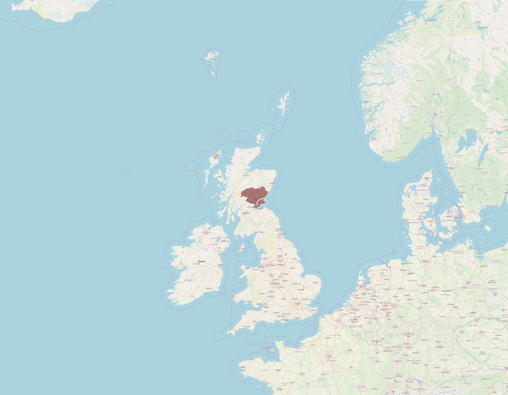

```{r setup, include=FALSE}
knitr::opts_chunk$set(echo = TRUE)
Sys.setenv(TZ='GMT')
```



<style>
img {
    width: 100%;
}
</style>

[NHS Health Boards](https://data.gov.uk/dataset/27d0fe5f-79bb-4116-aec9-a8e565ff756a/nhs-health-boards)

```{r shapefiles, echo=FALSE, cache=TRUE, warning=FALSE}
#https://digital.nhs.uk/services/organisation-data-service/data-downloads
library("sf")
library("tidyverse")
nhsshapefiles <- read_sf("SG_NHS_HealthBoards_2019/SG_NHS_HealthBoards_2019.shp")

# plot <- nhsshapefiles %>%
#   ggplot() +
#   geom_sf() +
#   geom_sf(data = nhsshapefiles[12,], aes(fill = "red"))

plot <- nhsshapefiles %>%
  ggplot() +
  geom_sf() +
  geom_sf(data = nhsshapefiles[12,])

plot
```

[Data downloads](https://digital.nhs.uk/services/organisation-data-service/data-downloads)

[NHS Scotland Open Data](https://opendata.nhs.uk/home)

[NHS Open API](https://www.england.nhs.uk/digitaltechnology/connecteddigitalsystems/interoperability/open-api/)

[Dundee Council](https://github.com/DundeeCityCouncil)
