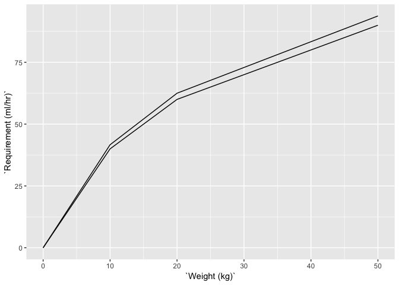

Fluid Balance
================

Just demonstrating some data used in fluid balance.

E.g a 7kg infant requires 29 ml per hour.

<!-- -->

If I plot the 2 rules below, you can see a little difference in
calculated values towards the larger weight. But otherwise, pretty much
perfect.
