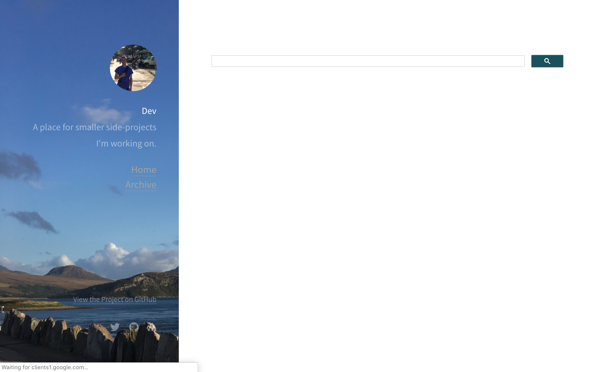

Study Resources for Medicine
================

Last updated: 2018-10-24

This is a list of medical resources I use as a reference for revision at
Medical School.

 This is a
custom search engine I built to look at BNF Interaction,
[Radiopaedia](#radiology), [Dermnet](#dermatology), Emedicine, NICE,
Child BNF, Evidence NHS, Nice Pathways, SIGN, CKS, and the BNF. These
are all fantastic resources, and the only reason I’ve brought them
together like this is so that I could toggle between the results,
without searching on each of the websites individually.

# A and E

[LIFE IN THE FAST LANE](http://lifeinthefastlane.com/)

An Australian Emergency Medicine website that is very popular amongst
Emergency Medicine trainees.

[ANATOMY for EMERGENCY
MEDICINE](http://emergencymedicineireland.com/and-em/)

An anatomy podcast.

[EMERGENCY MEDICINE CASES](http://emergencymedicinecases.com/)

In-depth podcasts on common EM presentations

[RESUSCITATION COUNCIL UK](https://www.resus.org.uk/pages/glalgos.html)

Organisation that develops and promotes resuscitation courses and
life-support algorithms.

[SUTURING HOW-TO](http://www.youtube.com/watch?v=e1jThI5wbVw)

How to suture.

[UNIVADIS](http://www.univadis.co.uk/)

This combines GP Notebook, Merck Manual, BMJ Learning all in one site.
You do have to sign up, but no charge.

[ALMOST A DOCTOR](http://almostadoctor.co.uk/)

[RCEM LEARNING](http://www.rcemlearning.co.uk/)

The open access e-learning site for the Royal College of Emergency

[ST EMLYNS](http://www.stemlyns.org.uk/)

Really popular FOAMed resource which allows you be part of a virtual
hospital and learn from clinical cases.

[St Mungo’s](https://stmungos-ed.com/)

[R.E.B.E.L. EM](http://rebelem.com)

# Podcasts

[SOCMOB blog](http://socmob.org/videos/)

[The Skeptics Guide to Emergency
Medicine](https://itunes.apple.com/gb/podcast/the-skeptics-guide-to-emergency-medicine/id564247833?mt=2)

[The RAGE Podcast](http://ragepodcast.com/)

# Notation

[Evernote](https://www.evernote.com/)

[Notes](https://support.apple.com/en-gb/guide/notes/welcome/mac)

# Research

[Medscape](https://www.medscape.com/)

[BestPractice](https://bestpractice.bmj.com)

[The Knowledge Network](http://www.knowledge.scot.nhs.uk/home.aspx)

[NICE Evidence Search](http://www.evidence.nhs.uk)

[Clinical Knowledge Summaries](http://cks.nice.org.uk/#?char=A)

Summary of the current evidence base and practical guidance on best
practice in respect of over 330 common and/or significant primary care
presentations

# Dermatology

[Dermnet](https://www.dermnetnz.org/)

# Calculations

[Medicalc](https://www.mdcalc.com/)

[Wolfram alpha](http://m.wolframalpha.com/)

# Apps

[MyPsych](http://mypsych.nhsggc.org.uk/)

[RCH Clinical Guidelines (paeds)](http://www.rch.org.au/clinicalguide/)

[e-pocketbook (WHO
paeds)](https://www.rch.org.au/rch/apps/WHO/e-Pocketbook/)

[SIGN](https://itunes.apple.com/gb/app/sign-guidelines/id427569564?mt=8)

[NICE
Guidance](https://itunes.apple.com/gb/app/nice-guidance/id505146575?mt=8)

[NICE
BNF](https://itunes.apple.com/gb/app/bnf-publications/id1045514038?mt=8)

[NHS Palliative
Care](https://itunes.apple.com/gb/app/nhsscotland-palliative-care-guidelines/id964222025?mt=8)

[Cancer Referral Guide](http://www.cancerreferral.scot.nhs.uk/)

[THERAPEUTICS HANDBOOK](http://www.ggcprescribing.org.uk/)

This is the link to the handbook used by medical staff across Glasgow to
assist with prescribing and common presentations. Available as an app
and on-line, it is a must for day-to-day
working.

[Microguide](https://itunes.apple.com/gb/app/microguide/id447171786?mt=8)

[Cochrane Library](https://www.cochrane.org/news/cochrane-library-app)

# Recording

[elogbook](https://www.elogbook.org/)

[NHS eportfolios](https://www.nhseportfolios.org/Anon/Login/Login.aspx)

# Lab Normal Values

# OSCE

[Geeky Medics](https://geekymedics.com/)

[The Unofficial Guide to
Medicine](http://zeshanqureshi.com/unofficial-guide-to-medicine/)

[UofG
::Podcasts](https://itunes.apple.com/itunes-u/clinical-skills/id528255713?mt=10)

# Renal

[Renal](http://openmed.co.uk/curriculum/renal/)

[Ediburgh Renal](http://www.edren.org/pages/handbooks.php)

# Psychiatric

[Royal College of Psychiatry Info Leaflets](www.rcpsych.ac.uk)

[Main UK eating disorder support](www.b-eat.co.uk)

[Another site, eating disorder support](www.eatingdisorderhope.com)

[Self help materials for eating disorders](www.anred.com)

[Psychiatric OSCE stations](www.trickcyclists.co.uk)

# Drugs

[PSA](https://prescribingsafetyassessment.ac.uk)

[50 Drugs]()

# GP

[General Practice Notebook](http://www.gpnotebook.co.uk/homepage.cfm)

# Radiology

[Radiopaedia](https://radiopaedia.org/)

[RADIOLOGY MASTERCLASS](http://radiologymasterclass.co.uk/)

Aimed specifically at medical students and junior doctors, this website
has frameworks for interpreting a variety of X-ray interpretations, with
test-yourself sections.

[iRefer](https://www.irefer.org.uk/)

# EBM

[James Lind
Alliance](http://www.jla.nihr.ac.uk/about-the-james-lind-alliance/)

[The Nuffield Trust](https://www.nuffieldtrust.org.uk/)

[The Cochrane Collaboration](https://cochrane.org)

[AllTrials](http://www.alltrials.net)

[OpenPrescribing](https://openprescribing.net)

[EBM Data Lab](https://ebmdatalab.net/)

[Healthwatch](http://www.healthwatch.co.uk)

[Quality Improvement Hub](http://www.qihub.scot.nhs.uk/default.aspx)

[NHS Improvement](https://improvement.nhs.uk)

[BestBETs](http://bestbets.org/teaching/current.php)

# Cardiology

[ECG](http://lifeinthefastlane.com/ecg-library/)

# Guidelines

[NICE Evidence Search](https://www.evidence.nhs.uk/)

[SIGN](https://www.sign.ac.uk/)

[Respiratory
Guidelines](https://www.brit-thoracic.org.uk/standards-of-care/guidelines/)

# Pathology

[Pathcal](https://www.pathcal.ac.uk/shibboleth/deliver/skin/layout/10/calindex.asp?CALid=118)

# Paediatrics

[RCH Clinical Practice Guidelines](http://www.rch.org.au/clinicalguide/)

# Obstetrics and Gynaecology

[The Royal Women’s
Hospital](https://www.thewomens.org.au/health-professionals/clinical-resources/clinical-guidelines-gps/)

# Orthopaedics

[Wheeless’ Textbook of Orthopaedics](http://www.wheelessonline.com/)

[Gait assessment](https://www.youtube.com/watch?v=PZBiv0uSXVg)

# Extra

[Kenhub](https://www.kenhub.com/en)

[ICD-10](http://apps.who.int/classifications/icd10/browse/2016/en#/F20)

[ECG Library and clinical
cases](http://lifeinthefastlane.com/ecg-library/)

[Scottish Partnership for Palliative
Care](https://www.palliativecarescotland.org.uk/)

# Question Banks

[Anki](https://apps.ankiweb.net/)

[Pastest](https://www.pastest.com/)

[BMJ
OnExam](www.onexamination.com/)

# Revision

[Cheatography.com](https://www.cheatography.com/ksellybelly/cheat-sheets/)

[Medical Flashcards](https://www.cram.com/medical)

[Quizlet](https://quizlet.com/)

[Osmosis](https://www.osmosis.org/)

[Meducation](https://meducation.net/popular)

[Revision
Music](https://play.spotify.com/user/spotify_uk_/playlist/1iHelgbMaB7G1bjMbABPRe)
