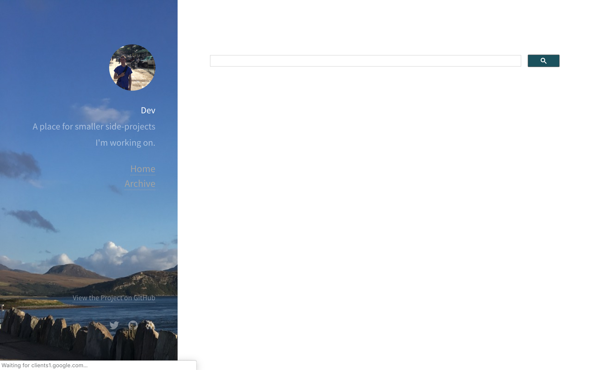
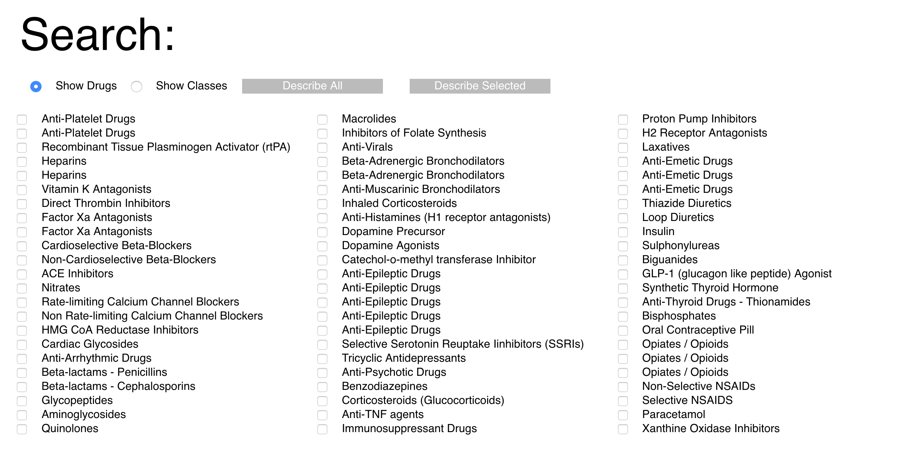

Last updated: `r Sys.Date()`

This is a list of medical resources I use as a reference for revision at Medical School.

<!-- TOC depthFrom:1 depthTo:6 withLinks:1 updateOnSave:1 orderedList:0 -->

- [Search](#search)
- [BNF Interactions](#bnf-interactions)
- [Top 50 Drugs](#top-50-drugs)
- [FOAMed](#foamed)

---

- [A and E](#a-and-e)
- [Podcasts](#podcasts)
- [Making notes](#making-notes)
- [Researching a topic](#researching-a-topic)
- [Dermatology](#dermatology)
- [Calculations](#calculations)
- [Apps](#apps)
- [Recording Procedures](#recording-procedures)
- [Lab Normal Values](#lab-normal-values)
- [OSCE](#osce)
- [Renal](#renal)
- [Psychiatric](#psychiatric)
- [Drugs](#drugs)
- [GP](#gp)
- [Radiology](#radiology)
- [EBM](#ebm)
- [Cardiology](#cardiology)
- [Guidelines](#guidelines)
- [Pathology](#pathology)
- [Paediatrics](#paediatrics)
- [Obstetrics and Gynaecology](#obstetrics-and-gynaecology)
- [Orthopaedics](#orthopaedics)
- [Question Banks](#question-banks)
- [Revision](#revision)

<!-- /TOC -->

# Search

This is a custom search engine I built to look at BNF Interaction, [Radiopaedia](#radiology), [Dermnet](#dermatology), Emedicine, NICE, Child BNF, Evidence NHS, Nice Pathways, SIGN, CKS, and the BNF.
These are all fantastic resources, and the only reason I've brought them together like this is so that I could toggle between the results, without searching on each of the websites individually.

I tend to use it to research for portfolio cases.

# BNF Interactions

This is a tool I built to visualise BNF Interactions. You can view the top 100 most commonly prescribed drugs.

Or create your own selection from any BNF-listed drugs.

# Top 50 Drugs

This is a tool originally built by University of Glasgow students as an SSC project.  
It gives revision information on 50 common drug classes.  
I've since built a new beta version, [here.](https://fergustaylor.github.io/Dev/50 Drugs/)

I've also exported the data as a .csv, and loaded it into Anki, a popular flashcard app. 
You can download the flashcards [here.](https://ankiweb.net/shared/info/1385997073)

# FOAMed

*FOAM – Free Open Access Meducation – Medical education for anyone, anywhere, anytime.*

*FOAM is a collection of resources, a community and an ethos. The FOAM community spontaneously emerged from the collection of constantly evolving, collaborative and interactive open access medical education resources being distributed on the web with one objective — to make the world a better place. FOAM is independent of platform or media — it includes blogs, podcasts, tweets, Google hangouts, online videos, text documents, photographs, facebook groups, and a whole lot more.*

[LITFL](https://lifeinthefastlane.com/foam/)

[Twitter Handle](https://twitter.com/hashtag/FOAMed?src=hash)

# A and E

Largely adapted from a list given to me as part of my A and E placement.

[LIFE IN THE FAST LANE](https://lifeinthefastlane.com/foam/)

An Australian Emergency Medicine website that is very popular amongst Emergency Medicine trainees.

[ANATOMY for EMERGENCY MEDICINE](https://emergencymedicineireland.com/)

An anatomy podcast.

[EMERGENCY MEDICINE CASES ](https://emergencymedicinecases.com/)

In-depth podcasts on common EM presentations

[RESUSCITATION COUNCIL UK](https://www.resus.org.uk/pages/glalgos.html)

Organisation that develops and promotes resuscitation courses and life-support algorithms.

[SUTURING HOW-TO](http://www.youtube.com/watch?v=e1jThI5wbVw)

How to suture.

[UNIVADIS](https://www.univadis.co.uk/)

This combines GP Notebook, Merck Manual, BMJ Learning all in one site.  You do have to sign up, but no charge.

[ALMOST A DOCTOR](https://almostadoctor.co.uk/)

[RCEM LEARNING](https://www.rcemlearning.co.uk/)

The open access e-learning site for the Royal College of Emergency

[ST EMLYNS](www.stemlyns.org.uk/)

Really popular FOAMed resource which allows you be part of a virtual hospital and learn from clinical cases.

[St Mungo's](https://stmungos-ed.com/)

[R.E.B.E.L. EM](http://rebelem.com)

# Podcasts
[SOCMOB blog](https://socmob.org/videos/)

Standing On the Corner, Minding my Own Business.  
A blog on a variety of ED/ critical care topics.

[The Skeptics Guide to Emergency Medicine](https://itunes.apple.com/gb/podcast/the-skeptics-guide-to-emergency-medicine/id564247833?mt=2)

[The RAGE Podcast](http://ragepodcast.com/)

The RAGE podcast is the resuscitationist’s awesome guide to everything!

[UofG ::Podcasts](https://itunes.apple.com/itunes-u/clinical-skills/id528255713?mt=10)

A series of clinical skills podcasts developed in collaboration with students and staff  at UofG.

# Making notes

Literally just 2 ways I like to keep notes.

[Evernote](https://www.evernote.com/)

[Notes](https://support.apple.com/en-gb/guide/notes/welcome/mac)

# Researching a topic

[Clinical Knowledge Summaries](https://cks.nice.org.uk/#?char=A)

Summary of the current evidence base and practical guidance on best practice in respect of over 330 common and/or significant primary care presentations

[NICE Evidence Search](https://www.evidence.nhs.uk/)

[The Knowledge Network](http://www.knowledge.scot.nhs.uk/home.aspx)

[BestPractice](https://bestpractice.bmj.com)

[Medscape](https://www.medscape.com/)

[ICD-10](http://apps.who.int/classifications/icd10/browse/2016/en#/F20)

# Dermatology
[Dermnet](https://www.dermnetnz.org/)

# Calculations
[Medicalc](https://www.mdcalc.com/)

[Wolfram alpha](https://www.wolframalpha.com/)

# Apps
[MyPsych](http://mypsych.nhsggc.org.uk/)

[RCH Clinical Guidelines (paeds)](https://www.rch.org.au/clinicalguide/)

[e-pocketbook (WHO paeds)](https://www.rch.org.au/rch/apps/WHO/e-Pocketbook/)

[SIGN](https://itunes.apple.com/gb/app/sign-guidelines/id427569564?mt=8)

[NICE Guidance](https://itunes.apple.com/gb/app/nice-guidance/id505146575?mt=8)

[NICE BNF](https://itunes.apple.com/gb/app/bnf-publications/id1045514038?mt=8)

[NHS Palliative Care](https://itunes.apple.com/gb/app/nhsscotland-palliative-care-guidelines/id964222025?mt=8)

[Cancer Referral Guide](http://www.cancerreferral.scot.nhs.uk/)

[THERAPEUTICS HANDBOOK](http://www.ggcprescribing.org.uk/)

This is the link to the handbook used by medical staff across Glasgow to assist with prescribing and common presentations.  Available as an app and on-line, it is a must for day-to-day working.

[Microguide](https://itunes.apple.com/gb/app/microguide/id447171786?mt=8)

[Cochrane Library](https://www.cochrane.org/news/cochrane-library-app)

# Recording Procedures
[elogbook](https://www.elogbook.org/)

[NHS eportfolios](https://www.nhseportfolios.org/Anon/Login/Login.aspx)

# Lab Normal Values

Ideally I want something for the reference values of each lab.  
So here's a citable link..

[Per hospital](http://www.nhsggc.org.uk/about-us/professional-support-sites/biochemistry/)

[North Glasgow Handbook](http://www.nhsggc.org.uk/media/245218/north-glasgow-biochemistry-user-handbook-r24-oct-2017.pdf)

And here's a revision reference..

[Geeky Medics Reference](https://geekymedics.com/reference-ranges/)

# OSCE
[Geeky Medics](https://geekymedics.com/)

[The Unofficial Guide to Medicine](http://zeshanqureshi.com/unofficial-guide-to-medicine/)

[UofG ::Podcasts](https://itunes.apple.com/itunes-u/clinical-skills/id528255713?mt=10)

[Psychiatric OSCE stations](www.trickcyclists.co.uk)

# Renal
[Ediburgh Renal](http://www.edren.org/pages/handbooks.php)

# Psychiatric
[Royal College of Psychiatry Info Leaflets](https://www.rcpsych.ac.uk/)

[Main UK eating disorder support](https://www.beateatingdisorders.org.uk/)

[Another site, eating disorder support](https://www.eatingdisorderhope.com/)

[Self help materials for eating disorders](https://www.anred.com/)

[Psychiatric OSCE stations](http://www.trickcyclists.co.uk/)

# Drugs
[PSA](https://prescribingsafetyassessment.ac.uk)

[BNF](https://bnf.nice.org.uk/)

# GP
[General Practice Notebook](http://www.gpnotebook.co.uk/homepage.cfm)

# Radiology
[Radiopaedia](https://radiopaedia.org/)

[RADIOLOGY MASTERCLASS](https://www.radiologymasterclass.co.uk/)

Aimed specifically at medical students and junior doctors, this website has frameworks for interpreting a variety of X-ray interpretations, with test-yourself sections.  

[iRefer](https://www.irefer.org.uk/)

# EBM
[James Lind Alliance](http://www.jla.nihr.ac.uk/about-the-james-lind-alliance/)

[The Nuffield Trust](https://www.nuffieldtrust.org.uk/)

[The Cochrane Collaboration](https://cochrane.org)

[AllTrials](http://www.alltrials.net/)

[OpenPrescribing](https://openprescribing.net)

[EBM Data Lab](https://ebmdatalab.net/)

[Healthwatch](https://www.healthwatch.co.uk/)

[Quality Improvement Hub](http://www.qihub.scot.nhs.uk/default.aspx)

[NHS Improvement](https://improvement.nhs.uk)

[BestBETs](https://bestbets.org/teaching/current.php)

# Cardiology
[ECG Library](https://lifeinthefastlane.com/ecg-library/)

# Guidelines
[NICE Evidence Search](https://www.evidence.nhs.uk/)

[NICE Guidelines](https://www.nice.org.uk/guidance)

[SIGN Guidelines](https://www.sign.ac.uk/)

[British Thoracic Society Guidelines](https://www.brit-thoracic.org.uk/standards-of-care/guidelines/)

[RCH Clinical Practice Guidelines](https://www.rch.org.au/clinicalguide/)

[The Royal Women's Hospital Guidelines](https://www.thewomens.org.au/health-professionals/clinical-resources/clinical-guidelines-gps)

[RCOG Guidelines](https://www.rcog.org.uk/en/guidelines-research-services/guidelines/)

# Pathology
[Pathcal](https://www.pathcal.ac.uk/shibboleth/deliver/skin/layout/10/calindex.asp?CALid=118)

# Paediatrics
[RCH Clinical Practice Guidelines](https://www.rch.org.au/clinicalguide/)

# Obstetrics and Gynaecology
[The Royal Women's Hospital](https://www.thewomens.org.au/health-professionals/clinical-resources/clinical-guidelines-gps/)

# Orthopaedics
[Wheeless' Textbook of Orthopaedics](http://www.wheelessonline.com/)

[Gait assessment](https://www.youtube.com/watch?v=PZBiv0uSXVg)

# Question Banks
[Anki](https://apps.ankiweb.net/)

[Pastest](https://www.pastest.com/)

[Peerwise](https://peerwise.cs.auckland.ac.nz/)

[BMJ OnExam](https://www.onexamination.com/)

# Revision

[Cheatography.com](https://www.cheatography.com/ksellybelly/cheat-sheets/)

[Medical Flashcards](https://www.cram.com/medical)

[Quizlet](https://quizlet.com/)

[Osmosis](https://www.osmosis.org/)

[Meducation](https://meducation.net/popular)

[Revision Music](https://play.spotify.com/user/spotify_uk_/playlist/1iHelgbMaB7G1bjMbABPRe)
